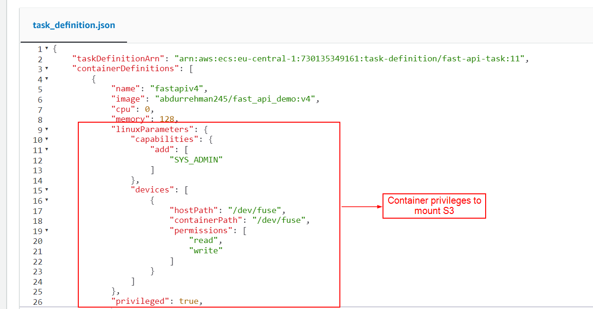

## Mount AWS S3 bucket into ECS (Elastic Container Service)

We will follow the following steps to mount S3 bucket into ECS container:

- Check which Linux distribution is running inside the container using command: 
    - `cat /etc/os-release`

- Check Linux architecture 
    - `uname -m`

- Choose the installation method from [Mount-S3](https://github.com/awslabs/mountpoint-s3/blob/main/doc/INSTALL.md) according to your Linux distribution and architecture

- We will install the mount-s3 on container startup and also launch our application (for example FAST API) in this case, so we are using `ENTRYPOINT(my_script.sh)` and entrypoint shell script will look something like this,

- Containers running in ECS by default does not have privileges to mount/demount the filesystem into container so in ECS task definition, we have to give them right privileges and also make sure that your task `ROLE must have right permissions to S3 bucket` otherwise you will get issues,

- Now, when you will launch your application, you will be able to see the S3 contents mounted into your container directory (where you have mounted).

- For testing purposes, you can follow the above steps directly into EC2 instance and launch the container in the EC2 using following docker command (you don’t need explicit task definition here)
    - `docker run -it --cap-add SYS_ADMIN --device /dev/fuse -p <host_port>:<container_port>  <image_name>:<tag> /bin/bash`

- Replace the placeholder accordingly and you will enter into the container and now follow the steps to mount s3 directly into container as, (in my case, using debian-based distribution so installation is accordingly)

    - cat /etc/os-release (check linux distrubution)
    - uname -m  (check linux architecture e.g. x86_64)
    - apt update -y
    - wget https://s3.amazonaws.com/mountpoint-s3-release/latest/x86_64/mount-s3.deb
    - apt install ./mount-s3.deb -y
    - mount-s3 --version (verify installation)
    - add role with s3 access to EC2 instance
    - mkdir /home/mnt
    - mount-s3 s3fstest-bucket101 /home/mnt

- Now you have successfully mounted s3 into your container `/home/mnt` working directory and you can view the contents of you s3 bucket inside the container using `ls -la`

### References
- https://github.com/s3fs-fuse/s3fs-fuse (follow this for s3 mount)
- https://github.com/awslabs/mountpoint-s3/blob/main/docker/README.md
- https://github.com/awslabs/mountpoint-s3/blob/main/docker/README.md
- https://docs.aws.amazon.com/AWSCloudFormation/latest/UserGuide/aws-properties-ecs-taskdefinition-device.html
